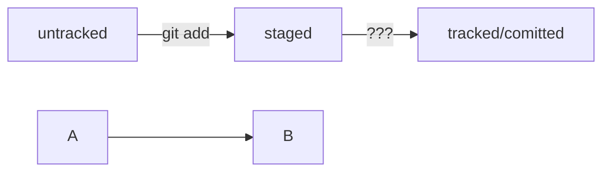

# git-fork-case
Repository for git fork case.

**test**
1. first
2. second


```mermaid
graph LR;
  untracked -- "git add" --> staged;
  staged    -- "???"     --> tracked/comitted;

%% стрелка без текста для примера: 
  A --> B;
```

```python
print("hello")
``` 
